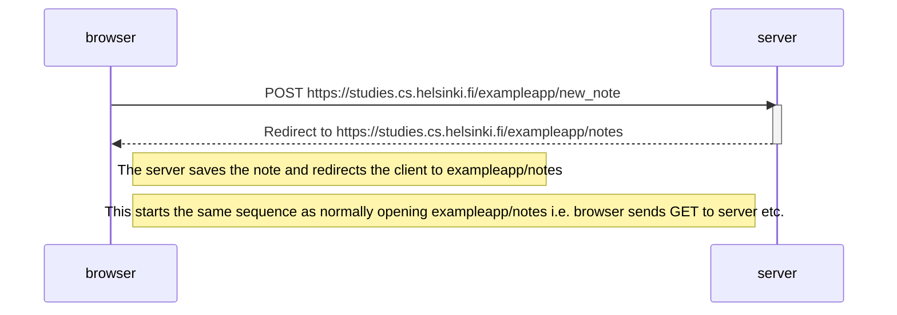

0.4 Create note 

```mermaid
sequenceDiagram
    participant browser
    participant server
    
    browser->>server: POST https://studies.cs.helsinki.fi/exampleapp/new_note
    activate server
    server-->>browser: Redirect to https://studies.cs.helsinki.fi/exampleapp/notes
    deactivate server

    Note right of browser: The server saves the note and redirects the client to exampleapp/notes 

    Note right of browser: This starts the same sequence as normally opening exampleapp/notes i.e. browser sends GET to server etc.

```